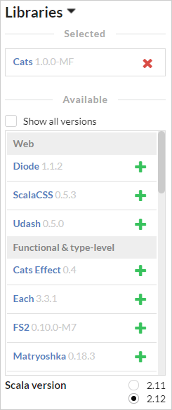
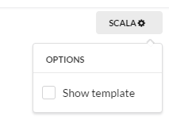
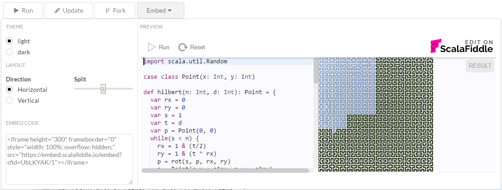

# Welcome to ScalaFiddle

ScalaFiddle is an online playground for creating, sharing and embedding Scala fiddles (little Scala programs that run
directly in your browser).

## Quick start

Just write some Scala code in the editor on the left and click the **Run** button (or press `Ctrl-Enter` on Windows/Linux, or
`Cmd-Enter` on macos) to compile and run your code. The result will be shown here, replacing this documentation. You can
always get this page back by clicking the **Help** button.

A truly simple example to get you started:

```scala
println("Hello world!")
```

## Saving your masterpiece

To make the fruit of your labors immortal, click the **Save** button. This will assign a random identifier to your fiddle and
update the page URL to something like `https://scalafiddle.io/sf/S0mXhH9/0`. The last part of the URL is a _version number_,
which is incremented every time you updated the fiddle. This means that once a fiddle is saved, it cannot be modified, but a
new version can be created.

By default, all fiddles are _anonymous_, but if you want to keep them under your own control, you should create an account
via **Sign in with GitHub**. This way no one else but you can update the saved fiddle. Others can only **Fork** it to
continue work under their own account.

To make sure you can later find your fiddle, remember to add a **Name** and **Description** to your fiddle before saving.

## Using libraries

You can experiment with different supported Scala libraries by selecting them from the **Libraries** section on the left
sidebar. Just press the **+** button to add a library to your fiddle, and **X** to remove it. The latest version is shown by
default, but you can also **Show all versions** if you need to work with an older one.



By default new fiddles use Scala 2.12, but you can also select another Scala version.

## Editing code

Although the editor in ScalaFiddle is no match for a full IDE, it's quite adequate for small fiddles. It provides rudimentary
syntax highlighting and things like _search_ (`Ctrl/Cmd-F`). You can also access code completion by pressing `Ctrl/Cmd-Space`
to get a list of potential completions suitable for that location. Note that this feature actually calls the remote compiler
to perform the code completion, so there might be a slight delay.

Your fiddle code is actually contained in a template, which you can show by clicking the **SCALA** button in the top-right
corner of the editor.



This template makes sure your code is contained in a single _object_ that is exposed to JavaScript so that it can be
executed. Normally you don't need to deal with the template, but sometimes you need to take things outside this object and
then it's necessary to edit the code on the outside.

## Special features

Because ScalaFiddle runs in the browser, you can access browser features like the DOM and Canvas in your fiddle. There is a
helper object called `Fiddle` that contains methods for accessing the DOM and the built-in canvas.

### Using the DOM

The simplest way for using the DOM is to generate your DOM elements using the included **Scalatags** library. For this you
need to `import scalatags.JsDom.all._` and use `Fiddle.print` to show the DOM, as in the example below.

```scala
import scalatags.JsDom.all._

val h = h1("Hello world").render
Fiddle.print(h)
```

You can also make the DOM interactive as demonstrated by the simple fiddle below:

```scala
import scalatags.JsDom.all._

val textInput = input(placeholder := "write text here").render
val lengthButton = button("Length").render
val result = p.render
lengthButton.onclick = (e: Any) => result.innerHTML = textInput.value.length.toString

Fiddle.print(div(textInput, lengthButton), result)
```

### Drawing to canvas

ScalaFiddle automatically provides a rectangular canvas in the output panel that you can use for drawing. The canvas drawing
context is accessible via `Fiddle.draw` and represents a
[`CanvasRenderingContext2D`](https://developer.mozilla.org/en/docs/Web/API/CanvasRenderingContext2D).

To draw a small 50 by 50 pixel rectangle at position 10,10:
```scala
Fiddle.draw.rect(10, 10, 50, 50)
Fiddle.draw.stroke
```

For a more complex example, check out the <a href="https://scalafiddle.io/sf/UbLKYAK/6" target="_top">Hilbert curve demonstration</a>

## Embedding

While editing and sharing fiddles on scalafiddle.io website is great, you can also embed your fiddles to any web page you
like. The embedded fiddle provides interactive editing, so you could for example include a short example on your
documentation site or in your blog and have viewers play with it right there, on your own page.

To create an embedded fiddle, just click the **Embed** button, which will present you with some options, the HTML code you
need to copy paste, and a preview of what the embedded fiddle will look like.



Embedding instructive fiddles to your library documentation is a great way to let your library users try out features without
installing anything.
